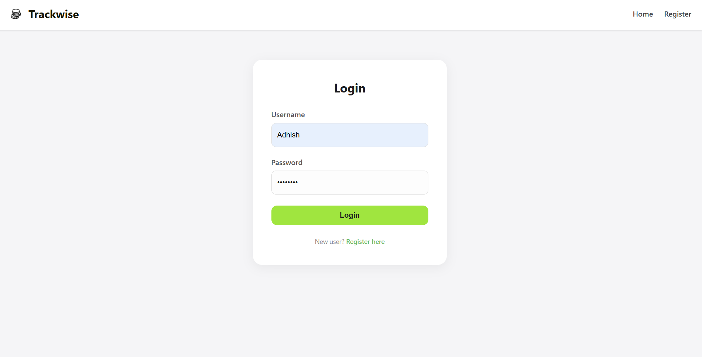
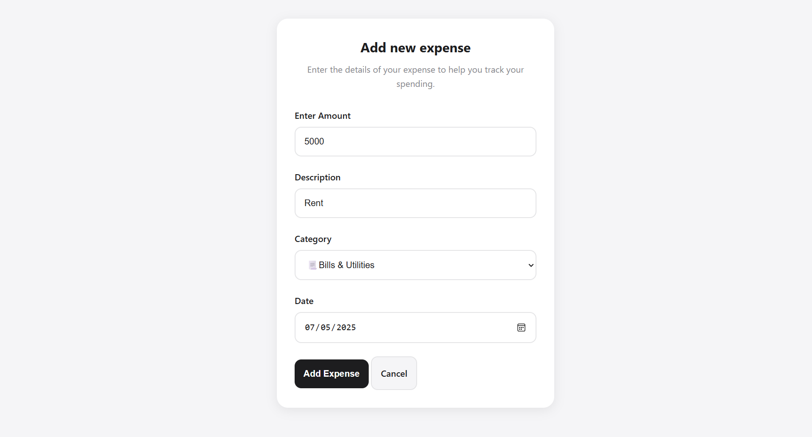
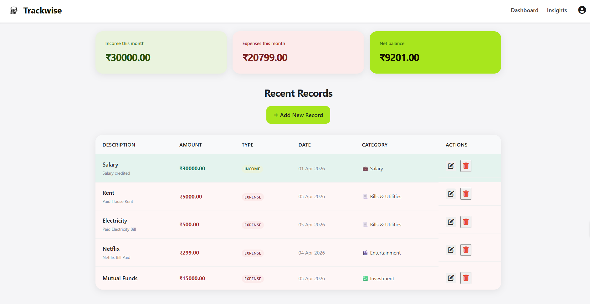
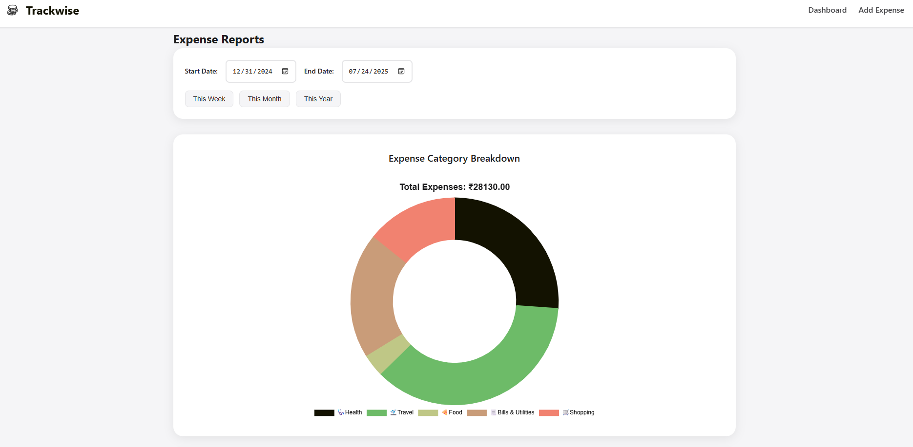

# 📊 Trackwise – Personal Expense Tracker 💰

Trackwise is a clean and responsive **personal expense tracking application** built with **Spring Boot** and **Thymeleaf**. It allows users to manage their daily expenses, visualize spending through charts, and maintain financial discipline, all from a single elegant interface.


---

## ✨ Features

- 🔐 User authentication (Login/Register)
- 🧾 Add, edit, and delete expenses
- 📅 Filter by date range (Monthly/Yearly)
- 📊 Insightful reports via:
  - Doughnut Chart (Category Breakdown)
  - Bar Chart (Category-wise Spend)
- 📁 Download reports as **PDF**
- 📱 Mobile-friendly, responsive UI
- 🧼 Role-based access (User/Admin)
- ✅ Secure with Spring Security

---

## 📸 UI Screenshots

**Login Page** 

  

 **Add Expense**
 
  

**Dashboard**

 

**Insights**

 


---

## 🛠️ Tech Stack

- **Backend:** Spring Boot, Spring Security, Spring Data JPA
- **Frontend:** Thymeleaf, HTML, CSS, JavaScript
- **Database:** H2 (Dev), MySQL (Prod-ready)
- **Visualization:** Chart.js
- **PDF Export:** jsPDF

---

## 🚀 Getting Started

### 1️⃣ Clone the repository
```bash
git clone https://github.com/Adhishak47/Trackwise
cd Trackwise
```

### 2️⃣ Set up your config
```bash
cp src/main/resources/application.properties.example src/main/resources/application.properties
# Edit and add your DB credentials, if needed
```

### 3️⃣ Build & Run
```bash
./mvnw spring-boot:run
```

App runs at: [http://localhost:8080](http://localhost:8080)

---

## 📁 Project Structure

```
src/
├── main/
│   ├── java/com/expense/tracker/
│   │   ├── config/
│   │   ├── controller/
│   │   ├── dto/
│   │   ├── model/
│   │   ├── repository/
│   │   ├── service/
│   │   ├── CategorySeeder/
│   │   └── ExpenseTrackerApplication.java
│   └── resources/
│       ├── static/
│       │   ├── css/
│       │   └── images/
│       ├── templates/
│       │   ├── index.html, login.html, reports.html ...
│       └── application.properties
```

---

## 📦 Dependencies

- `spring-boot-starter-web`
- `spring-boot-starter-thymeleaf`
- `spring-boot-starter-security`
- `spring-boot-starter-data-jpa`
- `h2-database`
- `chart.js`, `jsPDF`, `font-awesome`

---

