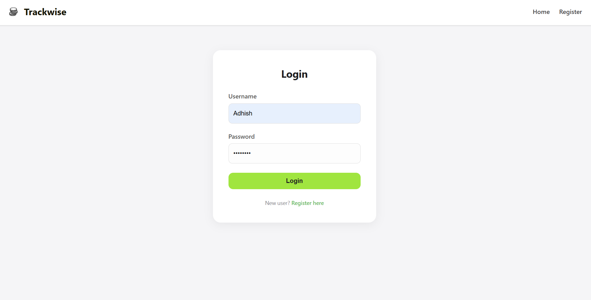
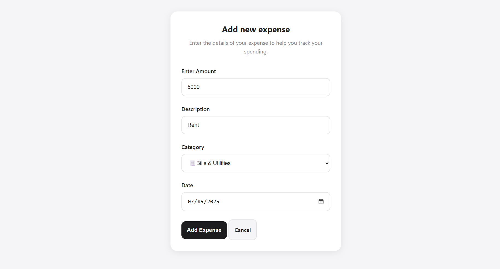
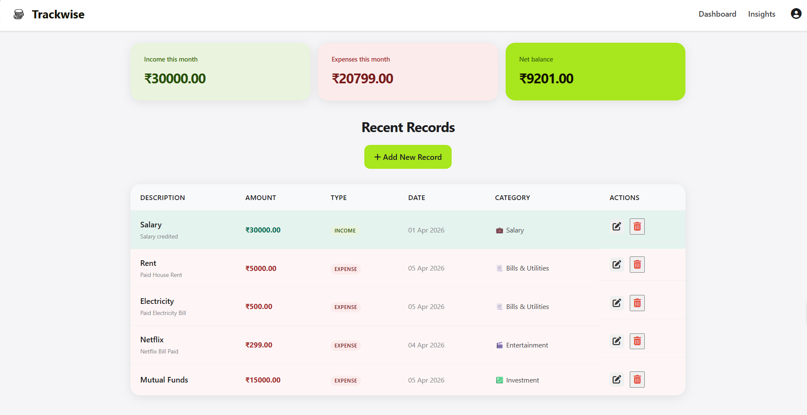
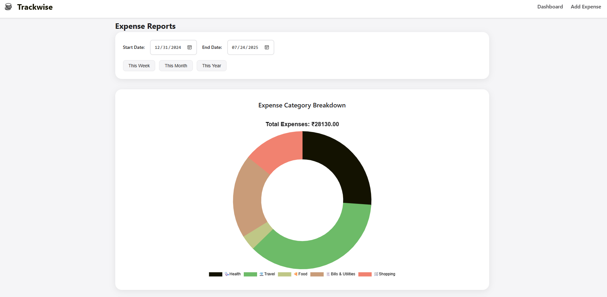
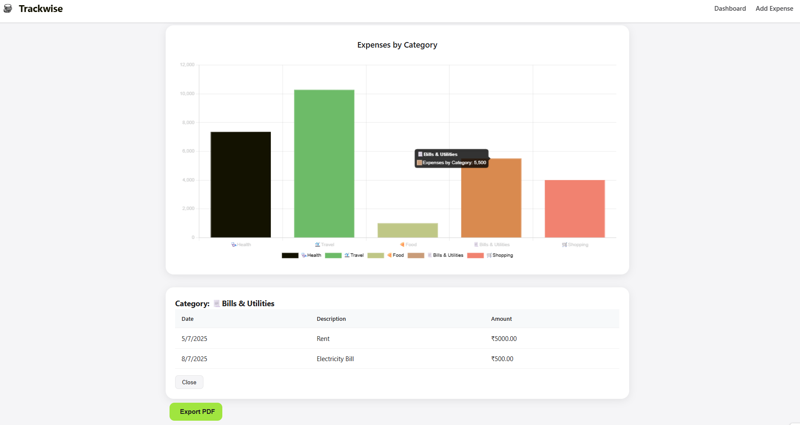

# 📊 Trackwise – Personal Expense Tracker 💰

Trackwise is a clean and responsive **personal expense tracking application** built with **Spring Boot** and **Thymeleaf**. It lets you track both income and expenses, visualise your spending through charts, manage financial records by category, and stay on top of your net balance, all from a single elegant interface.


---

## ✨ Features

- 🔐 User authentication (Login / Register)
- 👥 Role-based access — Viewer, Analyst, Admin
- 💸 Track income **and** expenses with typed categories
- 🧾 Add, edit, and delete financial records
- 📝 Optional notes on every record
- 📅 Filter by date range, category, or type
- 🔍 Keyword search across records
- 📄 Paginated record listing with sorting
- 📊 Insightful reports via:
  - Doughnut chart (category breakdown)
  - Bar chart (category-wise spend)
- 📈 Dashboard summary — total income, expenses, net balance, monthly trends
- 👤 Admin panel — manage users, roles, and account status
- 📁 Download reports as **PDF**
- 📱 Mobile-friendly, responsive UI
- ✅ Secure with Spring Security
---

## 📸 UI Screenshots

**Login Page** 

  

 **Add Expense**
 
  

**Dashboard**

 

**Insights**

 


---

## 🛠️ Tech Stack

| Layer | Technology |
|-------|-----------|
| **Backend** | Spring Boot 3.5, Spring Security 6 |
| **Persistence** | Spring Data JPA, Hibernate |
| **Database** | H2 (dev) / MySQL (prod-ready) |
| **Validation** | Hibernate Validator |
| **Frontend** | Thymeleaf, HTML, CSS, JavaScript |
| **Visualisation** | Chart.js |
| **PDF Export** | jsPDF / html2pdf.js |
| **Build** | Maven |
| **Tests** | JUnit 5, Mockito |

---

## 🚀 Getting Started

### 1️⃣ Clone the repository
 
```bash
git clone https://github.com/Adhishak47/Trackwise
cd Trackwise/expense-tracker
```
 
### 2️⃣ Set up your config
 
```bash
cp src/main/resources/application.properties.example \
   src/main/resources/application.properties
```
 
### 3️⃣ Build & Run
 
```bash
./mvnw spring-boot:run
```
 
App runs at: **http://localhost:8080**
 
H2 console (dev): **http://localhost:8080/h2-console**
- JDBC URL: `jdbc:h2:mem:expense_tracker`
- Username: `sa` / Password: *(blank)*
 
### MySQL setup (optional)
 
Uncomment the MySQL block in `application.properties`:
 
```properties
spring.datasource.url=jdbc:mysql://localhost:3306/expense_tracker
spring.datasource.username=your_username
spring.datasource.password=your_password
spring.datasource.driver-class-name=com.mysql.cj.jdbc.Driver
```
---

## 📁 Project Structure

```
src/
├── main/
│   ├── java/com/expense/tracker/
│   │   ├── config/
│   │   │   ├── SecurityConfig.java
│   │   │   └── GlobalExceptionHandler.java
│   │   ├── controller/
│   │   │   ├── ApiAuthController.java
│   │   │   ├── ExpenseController.java
│   │   │   ├── AdminController.java
│   │   │   ├── DashboardController.java
│   │   │   ├── CategoryController.java
│   │   │   ├── HomeController.java
│   │   │   └── AuthController.java
│   │   ├── service/
│   │   ├── model/
│   │   ├── repository/
│   │   ├── dto/
│   │   └── CategorySeeder.java
│   └── resources/
│       ├── static/
│       │   ├── css/
│       │   └── images/
│       ├── templates/
│       └── application.properties
└── test/
```

---
## 🌐 API Reference
 
Trackwise exposes a REST API alongside the Thymeleaf UI. All API endpoints return JSON.
 
### Authentication
 
```
POST   /api/auth/login      →  JSON login, returns session cookie
POST   /api/auth/logout     →  Invalidate session
GET    /api/auth/me         →  Current user info
```
 
**Login:**
```json
POST /api/auth/login
{ "username": "admin", "password": "admin123" }
```
 
### Financial Records
 
```
POST   /api/expenses                          →  Create record            
GET    /api/expenses                          →  Paginated list           
GET    /api/expenses/all                      →  All records             
GET    /api/expenses/search?keyword=          →  Keyword search  
GET    /api/expenses/by-type/{INCOME|EXPENSE} →  Filter by type         
GET    /api/expenses/date-range               →  Filter by date range     
GET    /api/expenses/category/{id}            →  Filter by category       
GET    /api/expenses/total/category/{id}      →  Category total          
PUT    /api/expenses/{id}                     →  Update record          
DELETE /api/expenses/{id}                     →  Delete record           
```
 
### Dashboard
 
```
GET  /api/dashboard/summary              →  Income, expenses, net balance, trends  
GET  /api/dashboard/recent?limit=10      →  Most recent records                     
```
 
**Summary params:** `startDate`, `endDate` (ISO date, both optional, defaults to current month)
 
### Admin — User Management
 
```
GET    /api/admin/users                      →  List all users           
GET    /api/admin/users?enabled=true|false   →  Filter by status         
GET    /api/admin/users/{username}           →  Single user            
PATCH  /api/admin/users/{username}/role      →  Change role            
PATCH  /api/admin/users/{username}/status    →  Activate / deactivate    
```

## 📦 Dependencies
 
- `spring-boot-starter-web`
- `spring-boot-starter-thymeleaf`
- `spring-boot-starter-security`
- `spring-boot-starter-data-jpa`
- `spring-boot-starter-validation`
- `h2-database`
- `modelmapper`
- `chart.js`, `html2pdf.js`, `font-awesome`
 
---
 
## 🧪 Running Tests
 
```bash
./mvnw test
```
 
- `ExpenseServiceTest` — unit tests with mocked repositories
- `ExpenseControllerTest` — MockMvc controller tests with mocked service
